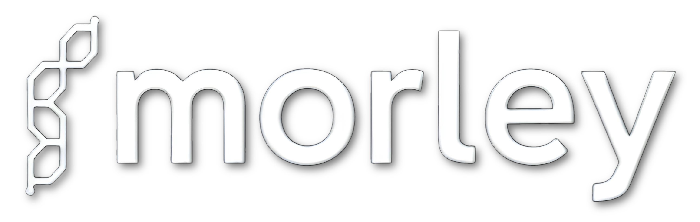
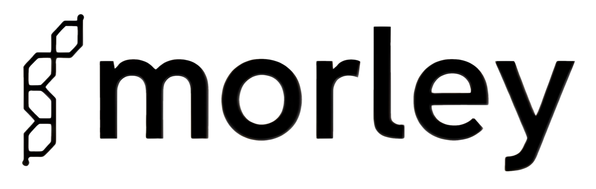
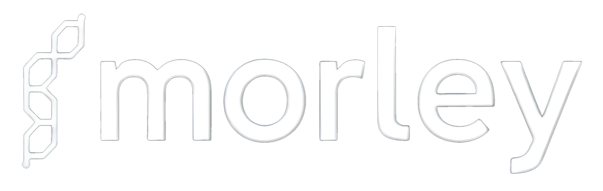
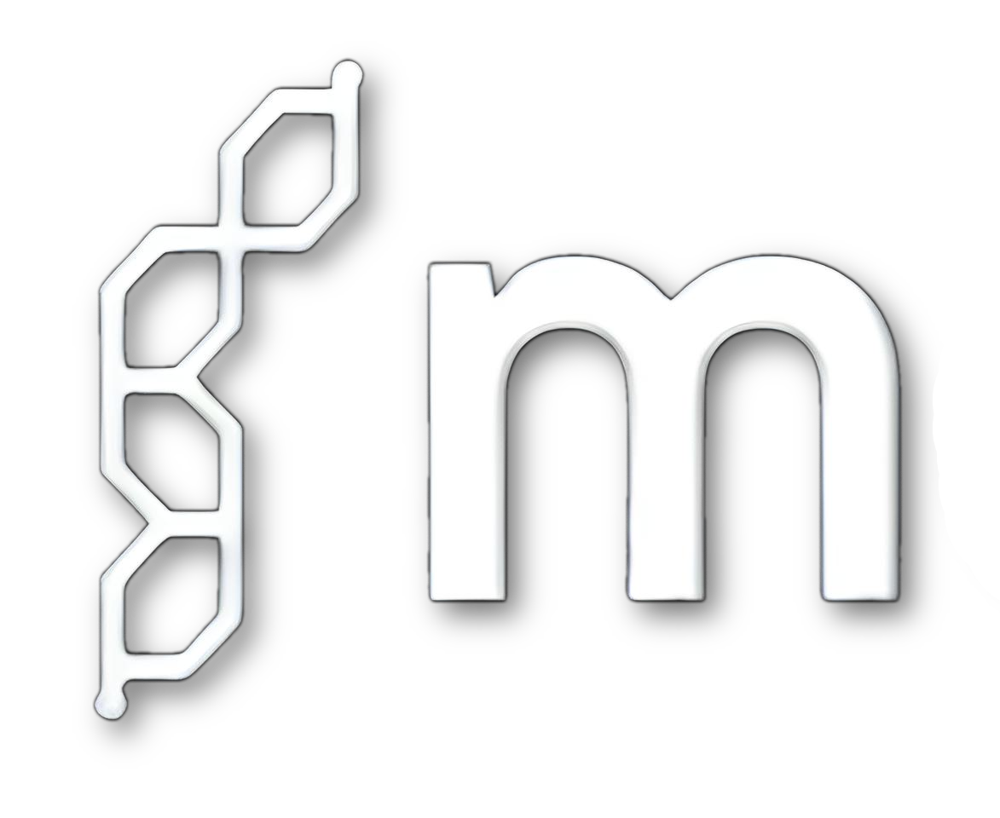
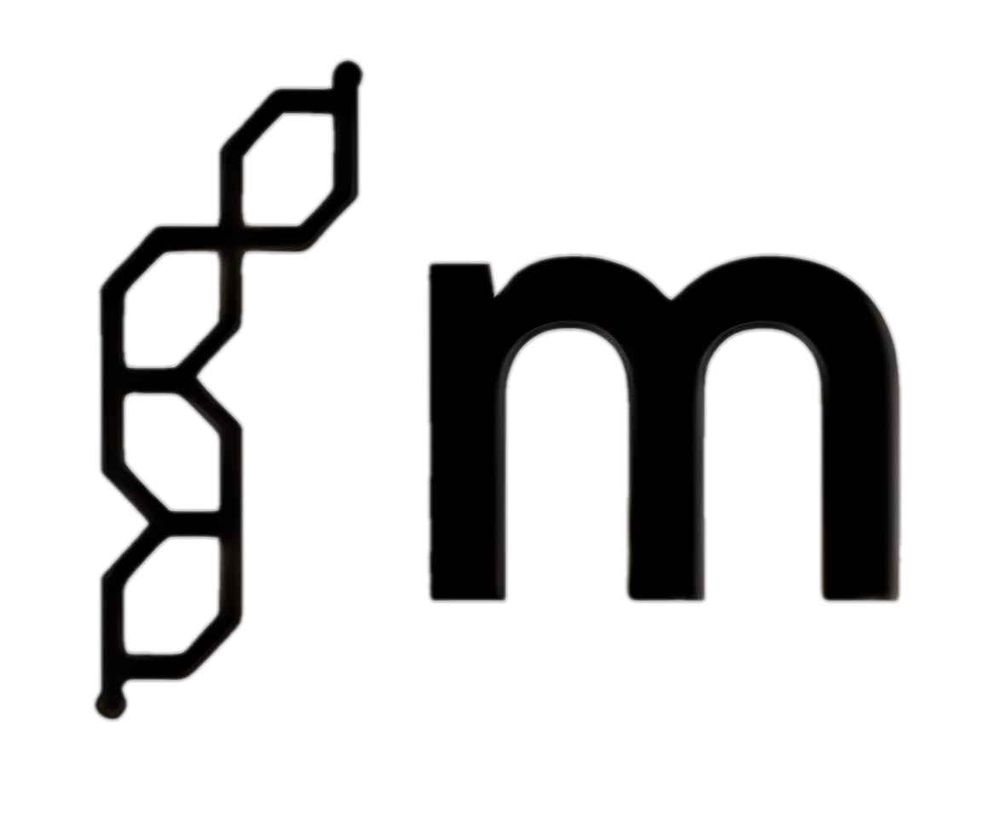
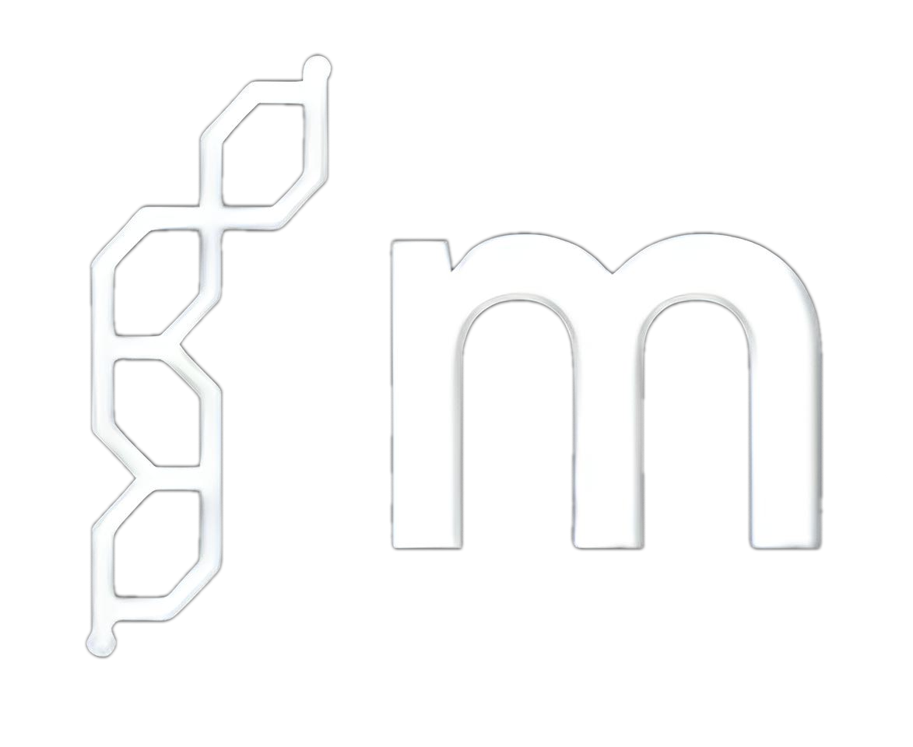

# Morley and ArkWriter Branding Guide

This document provides guidelines for using the **Morley** and **ArkWriter** brand assets, including logos, icons, and other design elements. These assets are optimized for both light and dark themes, ensuring consistency across various platforms and use cases.

---

## **🔸 Available Assets**

### **Morley Brand Assets**

#### **1️⃣ Full Logo for Multi-Use**

- **File Name:** `morley_logo_multi-use.png`
- **Usage:**  
  - Default logo for both light and dark backgrounds.
  - Recommended for websites, headers, and presentations where theme switching is common.

#### **2️⃣ Logo for Light Backgrounds**

- **File Name:** `morley_logo_for-light.png`
- **Usage:**  
  - Use on light backgrounds for optimal contrast.
  - Suitable for documents, slides, and white-themed websites.

#### **3️⃣ Logo for Dark Backgrounds**

- **File Name:** `morley_logo_for-dark.png`
- **Usage:**  
  - Use on dark backgrounds for optimal contrast.
  - Suitable for dark-mode interfaces, branding, or black-themed websites.

#### **4️⃣ Icon for Multi-Use**

- **File Name:** `morley_icon_multi-use.png`
- **Usage:**  
  - Default icon for both light and dark backgrounds.
  - Ideal for social media, app icons, or GitHub profiles.

#### **5️⃣ Icon for Light Backgrounds**

- **File Name:** `morley_icon_for-light.png`
- **Usage:**  
  - Use on light backgrounds for optimal contrast.
  - Suitable for white-themed interfaces or minimalist designs.

#### **6️⃣ Icon for Dark Backgrounds**

- **File Name:** `morley_icon_for-dark.png`
- **Usage:**  
  - Use on dark backgrounds for optimal contrast.
  - Perfect for dark-mode themes or black-themed interfaces.

---

### **ArkWriter Brand Assets**

#### **1️⃣ Logo for Multi-Use**

- **File Name:** `arkwriter_logo_multi-use.png`
- **Usage:**  
  - Use for both light and dark backgrounds.
  - Recommended for websites, headers, and presentations where theme switching is common.

#### **2️⃣ Logo for Light Backgrounds**

- **File Name:** `arkwriter_logo_for-light.png`
- **Usage:**  
  - Use on light backgrounds for optimal contrast.
  - Suitable for white-themed websites, presentations, and documents.

#### **3️⃣ Logo for Dark Backgrounds**

- **File Name:** `arkwriter_logo_for-dark.png`
- **Usage:**  
  - Use on dark backgrounds for optimal contrast.
  - Ideal for dark-mode UIs and black-themed websites.

---

## **🔸 Conceptual Artworks**

### **Morley Conceptual Logo**  

- **File Name:** `morley.png`
- **Description:**  
  This conceptual artwork represents the Morley brand's concept and direction. It is meant to symbolize innovation, progress and the potential of the Morley project. 
- **Usage:**  
  - Marketing and media materials such as banners, ads, or website headers.  
  - Presentation covers or reports.  
  - Social media visuals to enhance brand presence.  
- **Notes:**  
  - This is **not a functional logo** and should not replace the standard Morley logo in official or UI contexts.  
  - Maintain the original aspect ratio when resizing to ensure the design integrity remains intact.

---

## **🔸 Font Information**

### **1. Morley Logo Font**
The **Morley logo** uses a **modified version of the Neutro Demi font**.  
- **Font Family:** Neutro  
- **Weight:** Demi  
- **Modifications:** The logo's geometry has been slightly altered to enhance branding consistency.

### **2. ArkWriter Logo Font**
The **ArkWriter logo** uses the **Ubuntu Bold** font.  
- **Download the Ubuntu font family here:**  
  [Google Fonts – Ubuntu](https://fonts.google.com/specimen/Ubuntu)

---

## **🔸 Usage Guidelines**

### **1. Color Compatibility**
- **Multi-Use Assets:** Designed for dynamic environments where background colors may vary.
- **Light/Dark Specific Assets:** Use the correct version for better contrast and visibility.

### **2. Aspect Ratios**
- Full logos are designed with their aspect ratios in mind:
  - Maintain the original **logo aspect ratio** to avoid distortion.

### **3. Clear Space**
- Ensure a minimum clear space around the logo:
  - **Spacing:** Equal to the height of the "M" in "Morley" or "A" in "ArkWriter."

### **4. Scaling**
- Maintain a minimum width of 150 px for all logos.

### **5. Alterations**
- Do not modify colors, shapes, or proportions of the assets.
- If adjustments are needed, contact the branding team.

---

## **🔸 Download Locations**
All assets are available in the `branding/` folder:  
- **Morley Assets**:
  - Conceptual Logo: [`morley.png`](./branding/morley.png)
  - Multi-Use Logo: [`morley_logo_multi-use.png`](./morley_logo_multi-use.png)
  - Light Logo: [`morley_logo_for-light.png`](./morley_logo_for-light.png)
  - Dark Logo: [`morley_logo_for-dark.png`](./morley_logo_for-dark.png)
  - Multi-Use Icon: [`morley_icon_multi-use.png`](./morley_icon_multi-use.png)
  - Light Icon: [`morley_icon_for-light.png`](./morley_icon_for-light.png)
  - Dark Icon: [`morley_icon_for-dark.png`](./morley_icon_for-dark.png)
- **ArkWriter Assets**:
  - Multi-Use Logo: [`arkwriter_logo-multi-use.png`](./arkwriter_logo_multi-use.png)
  - Light Logo: [`arkwriter_logo_for-light.png`](./arkwriter_logo_for-light.png)
  - Dark Logo: [`arkwriter_logo_for-dark.png`](./arkwriter_logo_for-dark.png)

---

## **🔸 Contact for Branding Requests**
For specific use cases, questions, or custom asset requests, contact the Morley team:  
📩 **cyphrpool@gmail.com**
